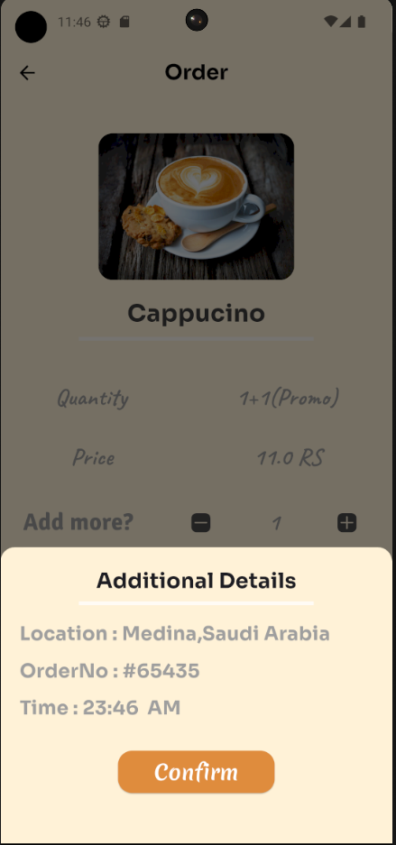
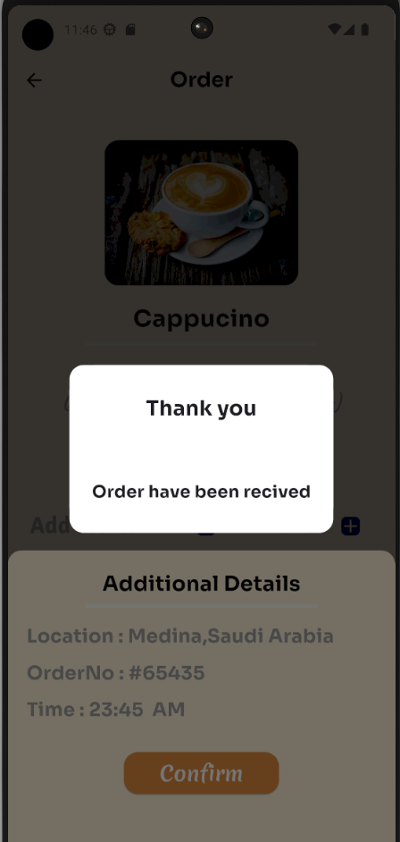
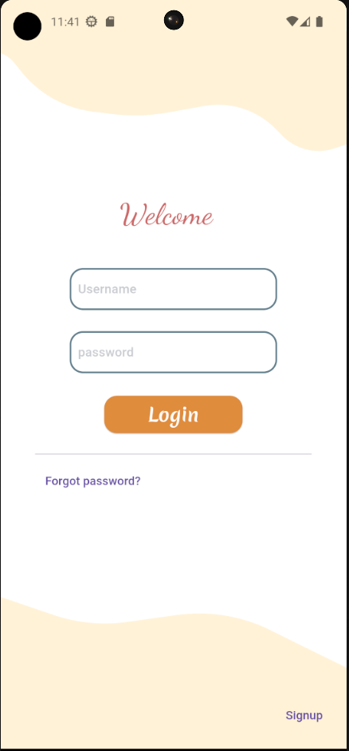
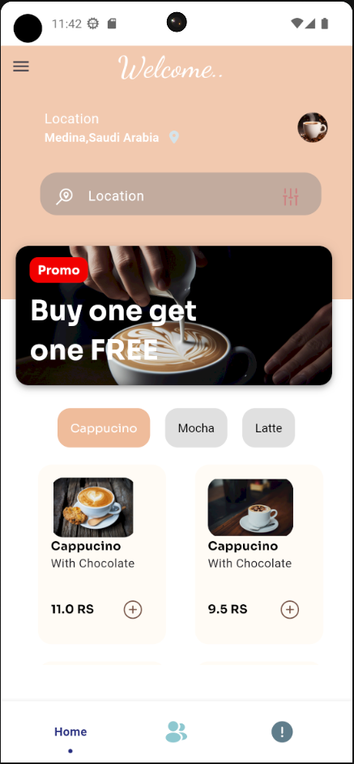
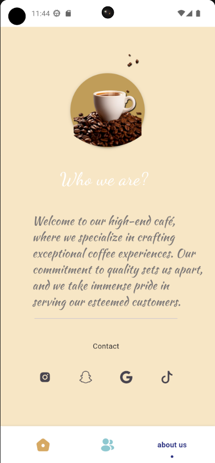
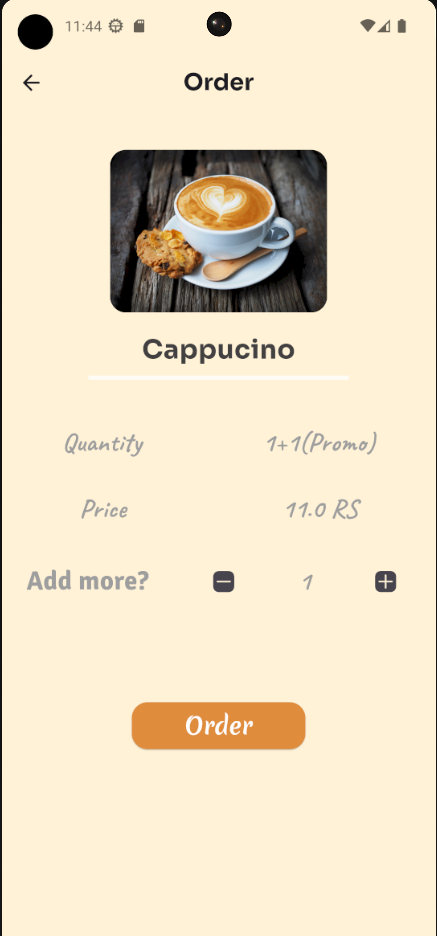
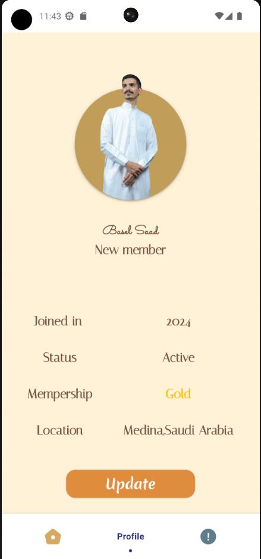

# Coffee shop app ☕️

## Overview

### Purpose
The purpose of this app is to enhance the customer experience at a coffee shop by providing an intuitive and convenient way to browse the menu, place orders.

### Features
- Menu Browsing: Users can browse a detailed menu with descriptions, prices, and images of various coffee drinks.

- Order Placement: Customers can place orders directly through the app, selecting their preferred items, customizing their orders.

- User Profiles: Customers can create and manage profiles

## Widgets & External Packages

### Main Widgets
- **TextField**: The `TextField` widget is used to allow users to input text.

- **BottomNavigationBar**: The `BottomNavigationBar` is used to navigate between different sections of the app, such as the menu, order history, and profile.

- **BottomSheet**: The `BottomSheet` widget is used to present a sliding panel from the bottom of the screen.



- **Drawer**: The `Drawer` provides an overlay menu that slides in from the side.


- **Alert dialog**: The `AlertDialog` widget is used to display important messages to the user, such as confirming an order.



### External Packages
- **flutter_flip_card**: A widget that does transition between two children in a flipping manner..
- **flashy_tab_bar2**: Nice animated bottom tab bar.
- **Icons Plus**: Is a package for Flutter developers that provides a collection of attractive icons from different packs.
- **google_fonts**: A Flutter package to use fonts from fonts.google.com.
- **Buttons TabBar**:  Is an open-source Flutter package that provides a tabbar where each tab indicator is a toggle button.

## Instructions for Running the App

### Prerequisites
- Flutter SDK

### Running the App
1. Clone the repository: 
   ```bash
   git clone https://github.com/Basel-75/Project-4.git
2. Navigate to the project directory: 
   ```bash
   cd Project-4

3. Install dependencies: 
   ```bash
   flutter pub get

4. Run the app on an emulator or connected device: 
   ```bash
   flutter run


## Output

### Screenshot








### Demo Video


## License

This project is licensed under the MIT License - see the [LICENSE](LICENSE) file for details.

## Contact

For more information, feel free to contact me via basel_1422@outlook.com or visit my GitHub profile @Basel-75.
