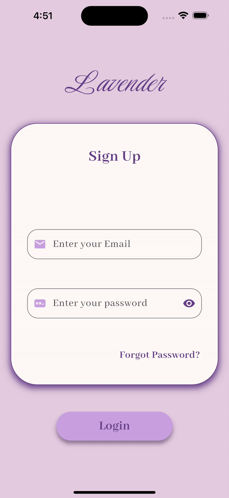
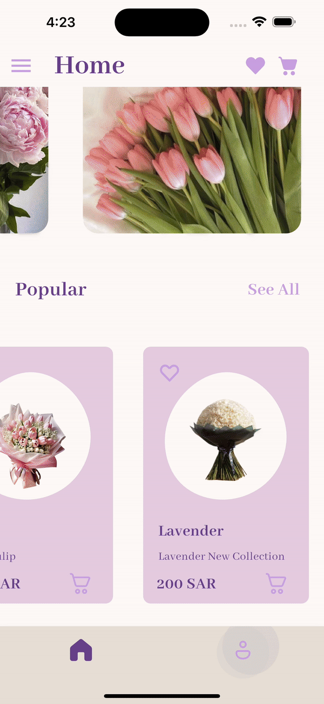

<p align="center">


# Lavender Shopping App 
Lavender is a Flutter UI project that delivers an appealing interface for browsing and purchasing a variety of flowers. It includes seven distinct screens, each designed to streamline the shopping experience and manage user data efficiently. The app makes full use of Flutter's rich set of widgets and features to create an engaging and intuitive experience.

## Getting started
 ### Dependencies
You need to install the Dart programming language and Flutter framework.

### Executing program
1- Copy url then go to terminal and write: 
```
git clone ‹url›
```
2- Go to the cloned project using:
```
 cd < PROJECT-NAME> /
 ``` 

3- To create and start dart project 
```
dart create project_name
cd project_name
code .
```

4- The program is now ready to run.

### installing  packege as a library 

#### Shimmer
Run this Command:
```
 $ flutter pub add shimmer_animation
```

#### Email Validator
Run this Command:
```
 $ flutter pub add email_validator
```

#### Animated Splash Screen
Run this Command:
```
 $ flutter pub add animated_splash_screen
```
 you will need also to install:
#### Page Transition
Run this Command:
```
 $ flutter pub add page_transition
```

#### Google Fonts
Run this Command:
```
 $ flutter pub add google_fonts
```

#### fluentui System Icons
Run this Command:
```
 $ flutter pub add fluentui_system_icons
```

#### Image Picker
Run this Command:
```
 $ flutter pub add image_picker
```

## App Overview

- This flower shopping app offers a seamless user experience starting with an introductory `splash screen` that showcases the logo for 3 seconds.

- Upon entering the app, users are directed with the `Sign-Up screen`, which requires account creation before they can proceed. The registration form includes:

   1. `Name`: This field is mandatory and cannot be left blank.

  2. `Phone Number`: Must be a 10-digit number; non-numeric characters are not accepted.

  3. `Email Address`: Must adhere to a valid format, such as **yara@gmail.com**.

  4. `Password`: Must be at least 8 characters long.

  5. `Confirm Password`: Must match the initial password.


  * Users can toggle password visibility using an eye icon. If any of the inputs are incorrect or invalid, an "Invalid Data" message will appear.

* On the `Login screen`, users need to enter their registered email and password. Both must meet the specified criteria to gain access to the Home screen.

* On the `Home screen`, users are greeted with a dynamic and engaging interface:

  * New Collection: A list view featuring images of the latest flower collections is displayed with a shimmering effect for the first 3 seconds to enhance visual appeal.

  * `Popular Items`: This section showcases a list of popular products, each item displayed with:

    1. An image of the product with an attractive shape to improve visibility
    2. The item title
    3. A subtitle providing additional details
    4. The item price
    5. Icons for adding to the cart and adding to the wishlist
    
    * Users can interact with the heart icon and cart icon, by clicking on them thay will filled with color.

   * `See All`: A clickable button allows users to view all products in a comprehensive list.

   * `Menu Icon`: Located at the top right corner, this icon opens a drawer containing the app logo and a button to viwe all product in a comprehensive list.
  
* The `All Products screen` features a `TabBar` interface that organizes different types of products:

  * Tab Bar: At the top of the screen, a tab bar allows users to switch between categories, including:

    1.  `Flowers`
    2.  `Bouquets`
    3. `Plants`

  * Grid View: Each tab displays a grid view of items within that category, providing a visually appealing and organized layout for browsing. Each grid item includes essential details such as 
    1. `images`
    2. `titles`
    3. `prices`.
    4. `subtile`.
    5. `CartIcon` and `WishListIcon`.

* In the Plants category, selecting a lavender item navigates users to the Item Screen, which includes:
`Item Image`, `Title`, `Subtitle`, `Price`, `Wishlist` and `Cart` Icons.
Additionally, there is a button labeled `About Lavender`. When clicked, this button opens an alert dialog containing information on how to care for the lavender plant, offering valuable care tips and guidance.

* Finally, the app includes a Profile Screen accessible via the `bottomNavigationBar`. This screen provides the following features:
  1. `User Information`: Displays details including the user’s profile image, name, phone number, and email address.
  2. `Profile Image`: Initially shows a default icon. Users can update this image by selecting a new one from their gallery. They must first grant the app permission to access their gallery for this functionality.
  3. `Select Image` Button: Provides the option to choose a new profile image. Once an image is selected, it updates the profile image displayed on the screen.
  4. `Logout` Button: Provides an option to log out, which navigates the user back to the Sign-Up screen for re-registration or login.


## Packeges
1. **Shimmer**: Provides a loading effect with a shimmering animation for 3 seconds to enhance visual appeal.

2. **Email Validator:** Ensures that the email address entered follows a valid format, such as user@example.com.

3. **Animated Splash Screen**: Displays a splash screen with an animation effect for 3 seconds when the app is launched.

4. **Page Transition**: Adds animated transitions between pages to create smooth and dynamic navigational experiences within the app.

5. **Google Fonts**: Utilizes a variety of fonts from Google Fonts to enhance the app’s typography and overall visual design.

6. **FluentUI System Icons**: Incorporates additional icons from FluentUI for modern iconography throughout the app.

7. **Image Picker**: Allows users to select and upload images from their gallery.

## Resourses
For shape code you can use this website :

Packeges: https://pub.dev/

Colors: https://colorhunt.co/

shape: https://www.blobmaker.app/

covert shape to code: https://fluttershapemaker.com/#/

## OutPut
The outcome of Lavender App:

Signup & Login screens:

<p align="center">




Home & AllProducts & Item screens:

<p align="center">


Profile Screen:

<p align="center">


## Language and freameWorkes
- Dart programming language
- Flutter framework

## Created by
**Yara Albouq**