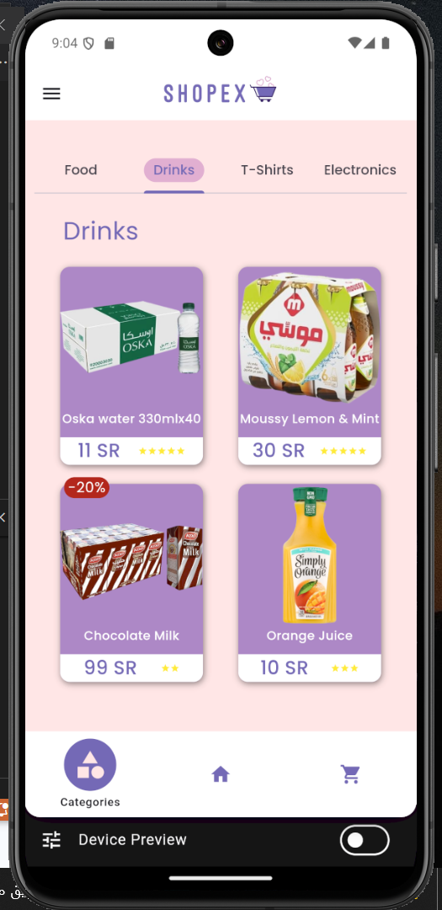

# Project 4 : Shopping App

 

## Welcome to `Shopex` 🛒
Easy, Extraordinary, Exceptional online shopping experience 🛒🥳

## 1. Overview 📖
In this project, we are supposed to build shopping application which contains a lot of features and user screens described later in this document. We were responsible of both **designing** and **coding** parts.

## 2. Why `Shopex` ❓
`Shopex` is considered the best shopping choice for having the following features.
- Gathering all kinds of needs in one place
- Easy navigation between sections

## 3. Requirements ⚔️
This Project requires multiple features which I will summerize below as follows.

#### 3.1 Widgets 🎨
In addition to custom widgets, I used the following widgets to satisfy the requirements

- **Drawer Widget** : Used to change profile picture and sign out

- **AlertDialog** : Used to display messages as tips or feedbacks to user

- **TextFields** : Used to recieve input from user

- **Navigation Between Views** : Used TabBar and TabBarView to navigate between categories.

#### 3.2 Packages 📚

- **Shimmer** : Shimmer was used to add loading effect on some content

- **GoogleFonts** : GoogleFonts is a package with various styles and fonts

- **ImagePicker** : ImagePicker was used to build page appplication

- **device_preview** : This package helped me visualize interfaces in many devices

- **animated_splash_screen** : Splash screen for `Shopex`.

## 4. Results ⭐

#### 4.1 Screenshots 📸
Here are some screenshots of the app interfaces.

#### 4.2 Video 🎥
For Storage purposes, Result as video is uploaded on drive [Click Here To See](https://drive.google.com/file/d/1dEgFdar1HynnNUbriQKTe628VCfEUbm8/view?usp=drive_link)

## 5. Conclusion 🏁
`Shopex` provides a smooth user experience where it gathers all daily needs in one app with a user-friendly and visually appealing interfaces.

Technically, I enjoyed using this large amount of widgets and connecting them together to build `Shopex`